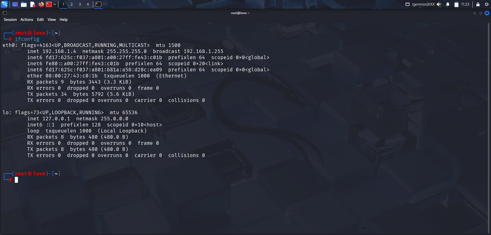
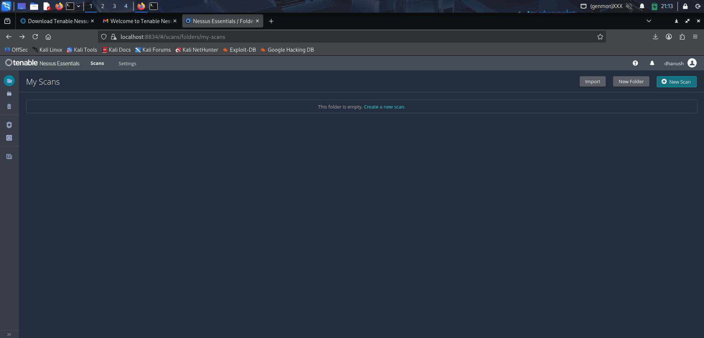
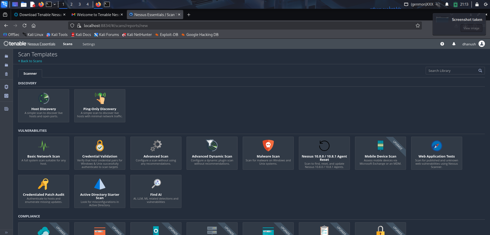
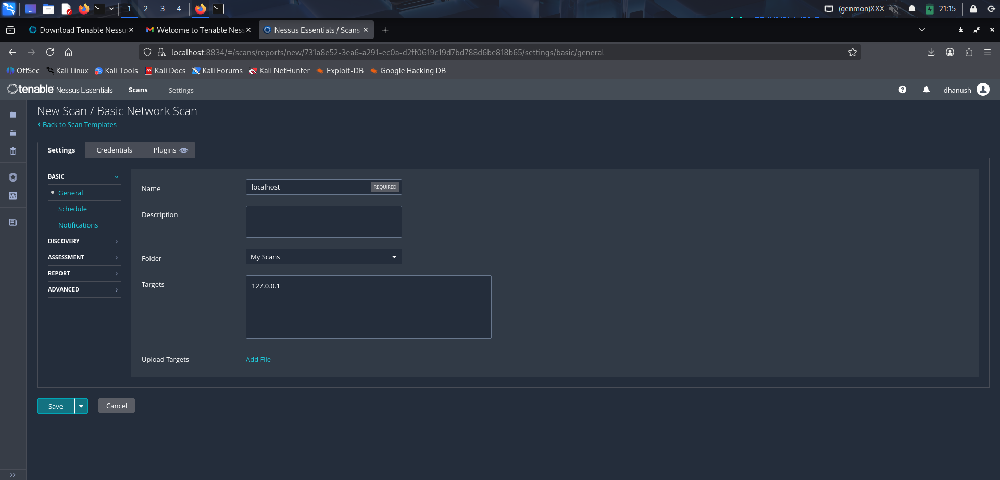
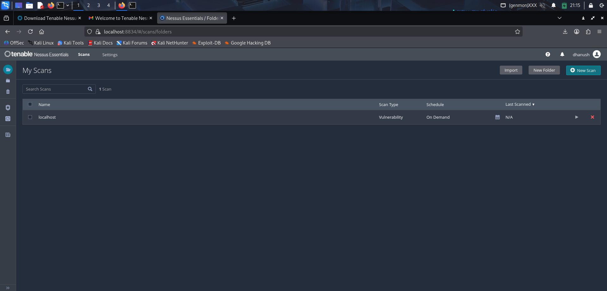
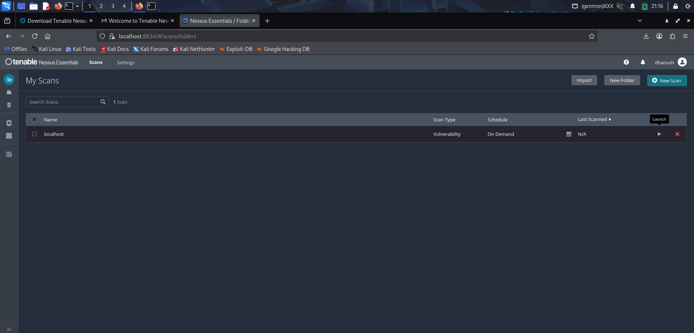
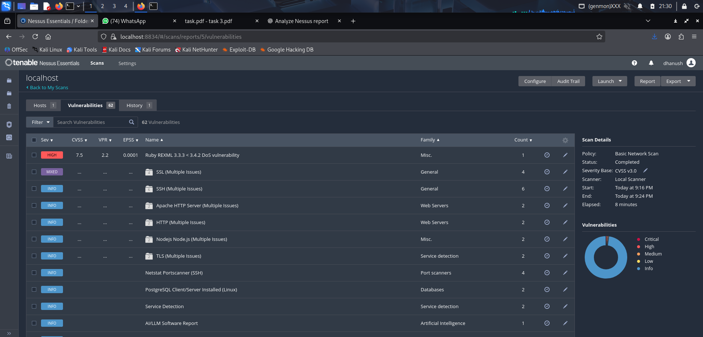

# 🛡️ Cyber Security Internship — Task 3

## 🔍 Basic Vulnerability Scan Using Nessus Essentials

---

### 🎯 Objective
Perform a **vulnerability assessment** of the local machine using **Nessus Essentials**, identify common security risks, and document findings with mitigation recommendations.

---

### 🧰 Tools Used
- **Operating System:** Kali Linux
- **Tool:** Nessus Essentials (Community Edition)
- **Target:** Localhost (127.0.0.1)

---

### ⚙️ Scan Configuration
- **Scan Type:** Basic Network Scan  
- **Scanner Type:** Local Scanner  
- **Policy:** CVSS v3.0  
- **Target:** 127.0.0.1  
- **Duration:** ~8 minutes  
- **Status:** Completed

---

### 📸 Screenshots
Below are the screenshots captured during the scanning process:

1. **Network Configuration**
   

2. **Nessus Dashboard**
   

3. **Scan Template Selection**
   

4. **Scan Target Setup**
   

5. **Scan Launch**
   

6. **Scan Running**
   

7. **Scan Completed - Results View**
   

---

### 📊 Scan Results Summary

| Severity | Count |
|-----------|-------|
| **Critical** | 0 |
| **High** | 1 |
| **Medium** | 3 |
| **Low** | 8 |
| **Info** | 50+ |

> Total Vulnerabilities Detected: **62**

---

### 🚨 Key Findings

#### 1. Ruby REXML DoS Vulnerability (CVE-2021-28965)
- **Severity:** High (CVSS 7.5)  
- **Description:** A denial-of-service vulnerability exists in Ruby REXML before 3.4.2.  
- **Mitigation:** Update Ruby REXML gem to version **3.4.2 or later**.

#### 2. SSL/TLS Configuration Issues
- **Severity:** Medium  
- **Description:** Multiple SSL/TLS weaknesses detected (deprecated protocols).  
- **Mitigation:** Disable **TLS 1.0/1.1** and weak ciphers in system configuration.

#### 3. SSH Multiple Issues
- **Severity:** Medium  
- **Description:** Weak SSH algorithms or outdated configurations.  
- **Mitigation:** Restrict SSH to strong ciphers such as **AES-256-CTR** and **SHA2**.

#### 4. Apache HTTP Server Multiple Issues
- **Severity:** Low  
- **Description:** General information disclosure and outdated modules.  
- **Mitigation:** Keep Apache packages updated and disable unused modules.

---

### 🧠 Key Learnings
- Understood how **Nessus Essentials** performs vulnerability detection using CVE and CVSS scoring.  
- Gained practical knowledge of **network scanning** and **system-level security auditing**.  
- Learned to differentiate between **vulnerability severities** and prioritize remediation efforts.

---

### 🧩 Concepts Covered
- Vulnerability Scanning  
- Risk Assessment  
- CVSS (Common Vulnerability Scoring System)  
- Remediation Practices  
- Security Tool Configuration

---

### 📝 References
- [Tenable Nessus Essentials](https://www.tenable.com/products/nessus/nessus-essentials)  
- [OWASP Security Testing Guide](https://owasp.org/www-project-web-security-testing-guide/)  
- [CVE Database](https://cve.mitre.org/)  

---

### ✅ Outcome
Successfully completed a **local vulnerability scan** using Nessus Essentials on Kali Linux, identified 62 vulnerabilities, and documented findings with mitigations.

### **Author**
- **Cybersecurity Intern – Task 3** 
- Your Name : DHANUSH S 
- Date: 24 Oct 2025
